# **vue3_echarts_demo_01**

## **Creating an interactive plot website with Vue3 and ECharts**

### **Ⅰ. Purpose** 

In data visualization, interactive plots can provide users with more information on interesting data. The content of this project is a demo to build an interactive plot website mainly with Vue3 and ECharts for the investment statistics of top ETFs in Taiwan.  

### **Ⅱ. Tools**

Front-End: Vue3, ECharts, Bootstrap   
Back-End: FastAPI, PostgreSQL  
Other: Selenium, Beautiful Soup, Docker, n8n  
 

### **Ⅲ. Statement** 

__1. The main components of this website__  

This interactive plot website has side-menu with five options. Only 4 options will be explained. 

__● Option -  Home__ 

Just a simple explanation and tree chart for looking through the content of this website. 

__● Option - Financial Info (ETF)__ 

Originally, 8 tabs were expected, but they all used the same method, so only 2 are listed for now. If interested, please refer to the project  [[dash_plotly_demo_01](<https://github.com/qinglian1105/dash_plotly_demo_01>)]. 

(1)Introduction: just a brief description about this study. 
(2)Overview: a dashboard with metrics, charts, and table. 

__● Option - Data Status (DB)__ 

Just display tables for checking whether data is inserted successfully or completely. 

__● Option - Auth (users)__ 

It's User Management. 

 

__2. Data__  

(1)Source  
Thanks for the website, "https://www.pocket.tw/etf/", provided by Pocket Securities. This company, one of the best Online Brokers in Taiwan, delivers high-quality services to customers, and its website makes it easier for investors to obtain financial data and useful information. 

(2)Web scraping 
The targeted data is the holding details, like stocks, bonds and so on, of exchange-traded fund (ETF) in Taiwan. The ETFs are selected according to the standard that they primarily invest in stocks and their asset value is more than one hundred billion (TWD). Therefore, 8 ETFs are selected in this project. Their security codes are '0050', '00878', '0056', '00919', '00929', '006208', '00940' and '00713' respectively. 
In addition, the information about ETF ranking by asset value, trading volume and so on, in Taiwan can be read on the website, Yahoo Finance (Taiwan). (Please refer to [details](<https://tw.stock.yahoo.com/tw-etf/total-assets>)) 
Besides, web scraping is primarily implemented by "Selenium" and "Beautiful Soup", and then data is saved into database. These tasks are built in a workflow by "n8n", as the workflow of ETF tools like Airflow or DolphineScheduler, scheduling and monitoring task execution. As you can see below. 

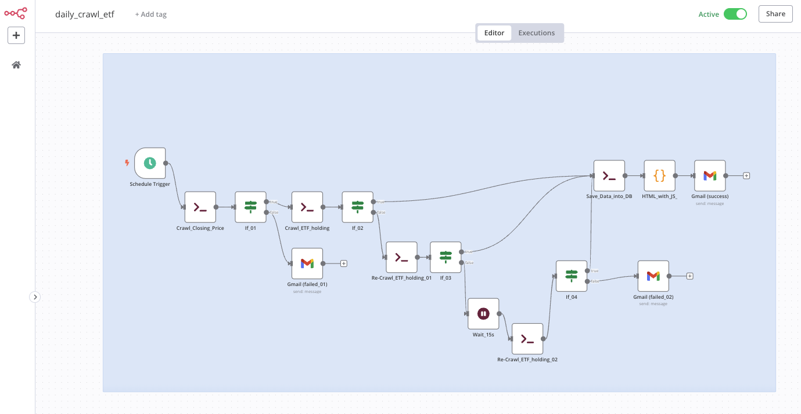
  

__3. How programming works__  

The data visualization platform, namely interactive plot website, is built in three parts. 
(1)Vue3 and ECharts are in charge of creating interactive plot. (Please refer to the folder   "[./app_vue](./app_vue)") 
(2)FastAPI gets data from the database, PostgreSQL, and then processes metrics, charts, and tables. (Please refer the project  [[dash_plotly_demo_01](<https://github.com/qinglian1105/dash_plotly_demo_01>)]) 
(3)The workflow of n8n, as just mentioned, operates periodically for crawling data from the website and saving data into database. The node "Gmail" in workflow will inform the results regardless of whether the workflow executed successfully or not.(Please refer to the similar project  [[n8n_py_js_demo_01](<https://github.com/qinglian1105/n8n_py_js_demo_01>)]) 

 

__4. Results__  

__● Page - Login & Logout__  

Path: /login 
(the background picture is created by Gemini) 

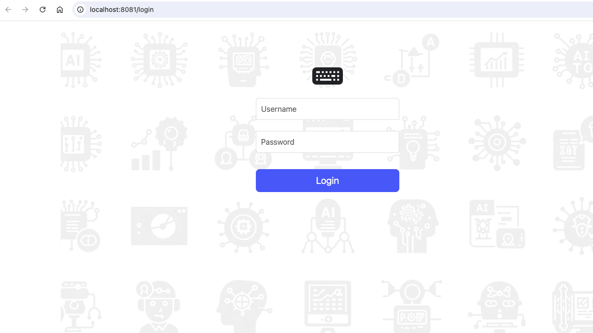
  

The message of "Alert" after submitting is wrong password or incorrect username. 

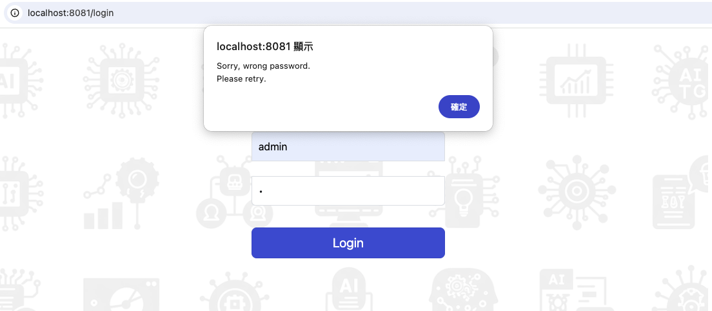
  

Path: /logout 

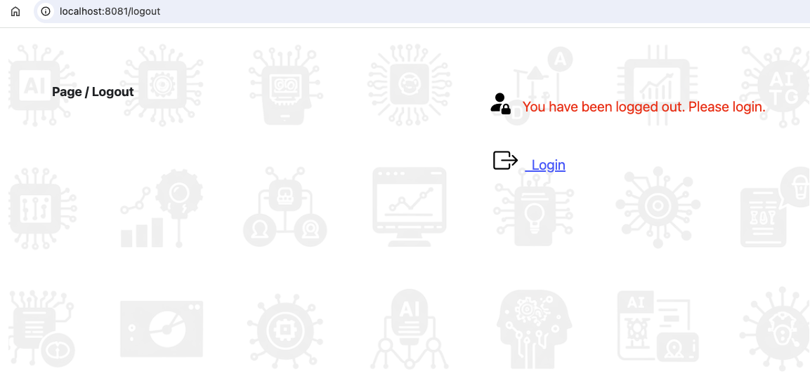
  

__● Page - Home__  

Home page: as mentioned above. 

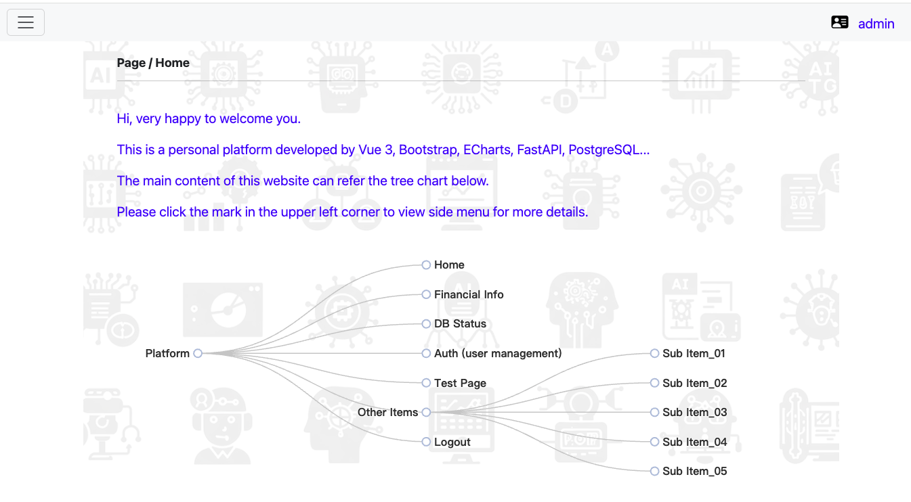
  

Home page with side menu. 

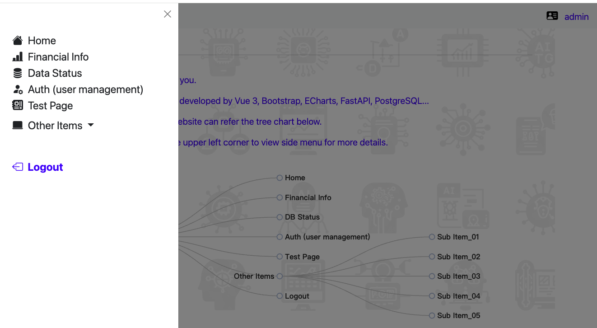
  

__● Option - Financial Info (ETF)__  

As mentioned above, this option is the statistics of top equity ETFs in Taiwan. 

(1)Introduction 

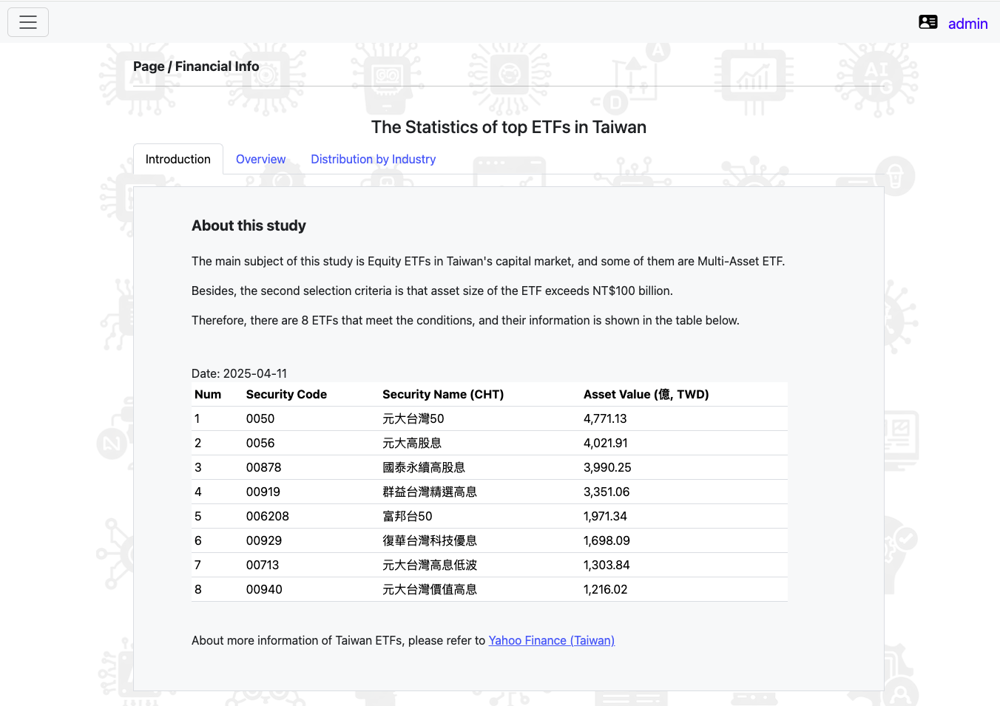
  

(2)Overview: a dashboard has a date picker to choose date for metrics, charts and tables. 

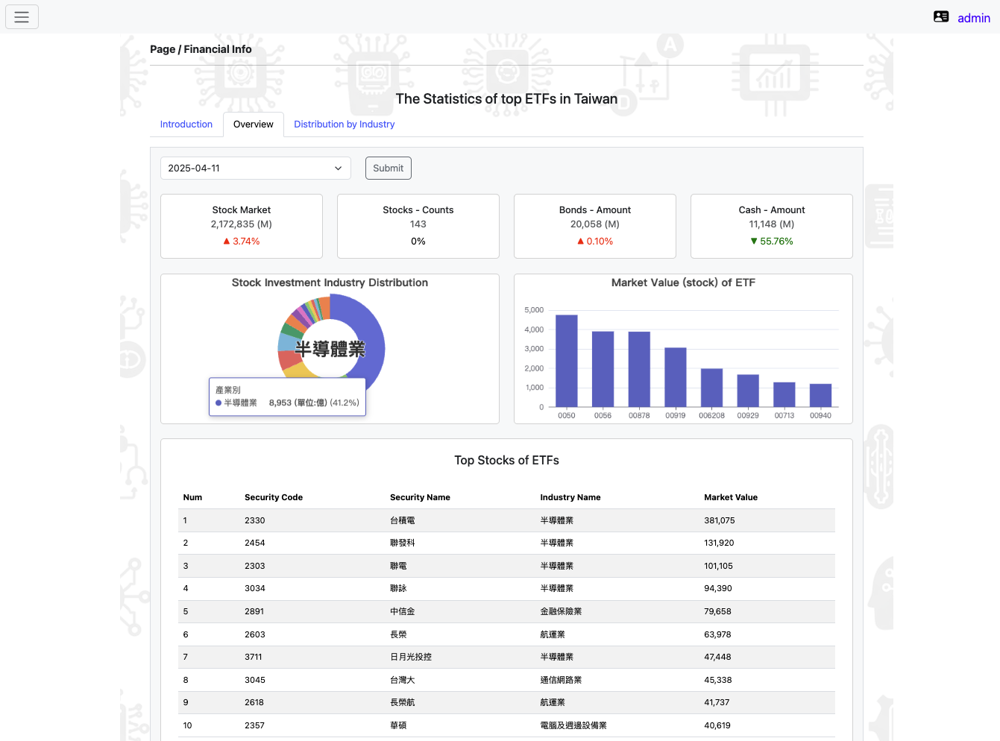
  

__● Option - Data Status (DB)__  

Display the status, including record counts and lastest records, in main tables of database, invest.  

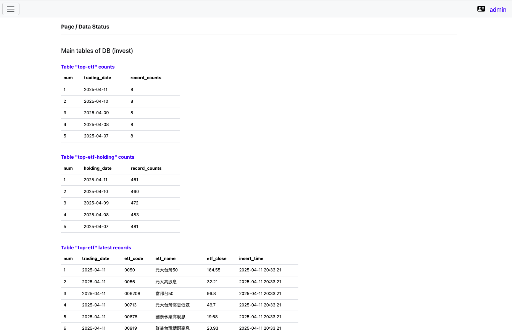
  

__● Option - Auth (users)__  

This is user management. Only authorized personnel can add new users, remove users, update information of users. Besides, Using 'Update' to revise the content of coloum 'Authority' can control users for accessible pages.  

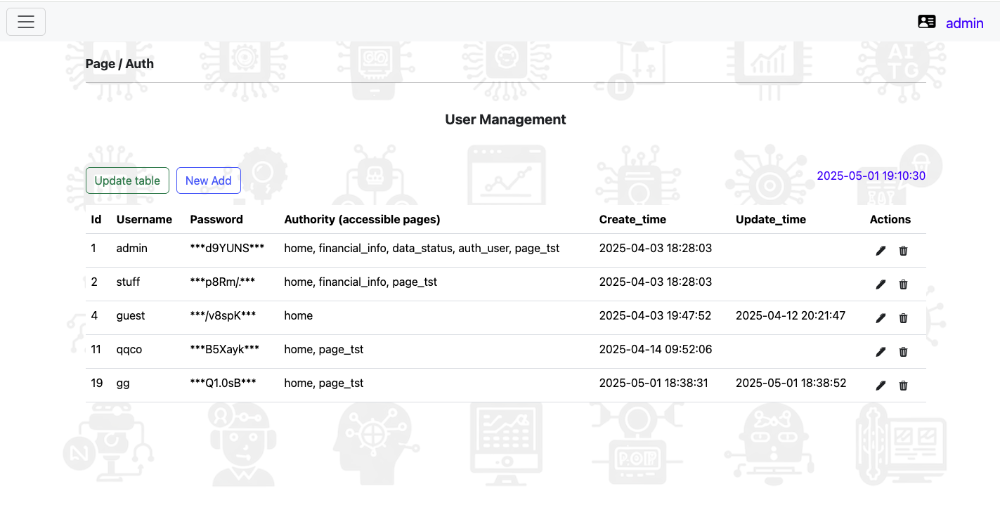
  

Click the button "New Add" to add new user.

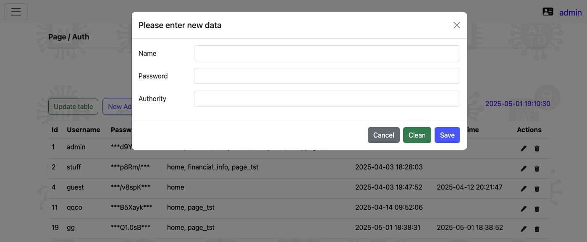
  

Click the icon "Pen" to edit user information.

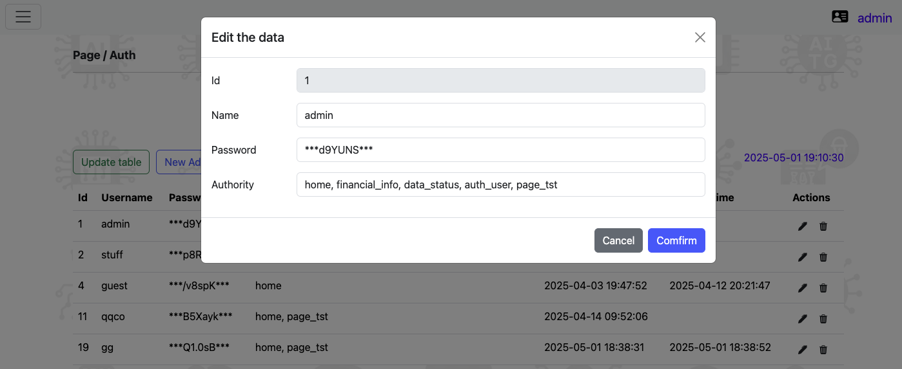
  

Click the icon "Trash can" to delete user information.

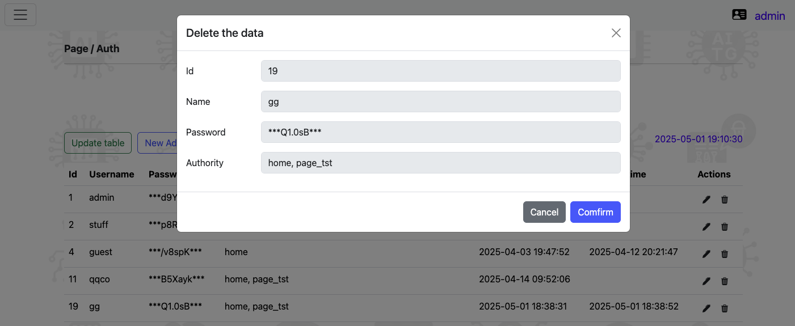
  

Take an example. The upper right corner of the picture below shows that login user is stuff, so he or she cannot access unauthorized pages according to the setting of column "Authority" in table - users.   

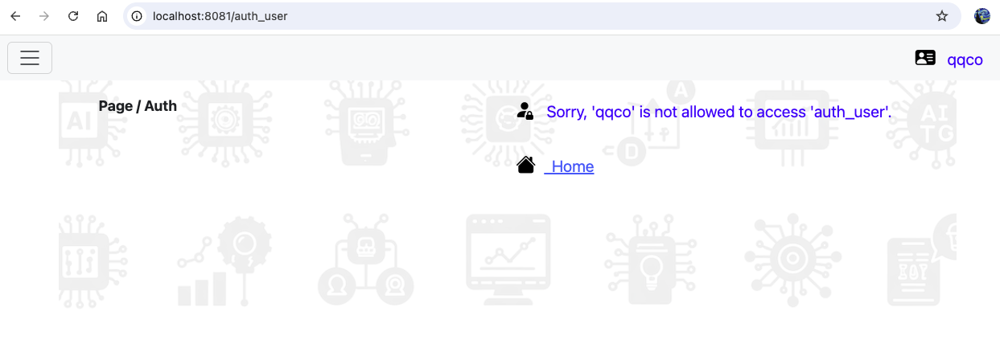
  

__The above offers an interactive plot website or data visualization platform with Vue3, ECharts, FastAPI and n8n for investment statistics.__  

 

---

### **Ⅳ. References**

[1] [Vue - Docs](<https://vuejs.org/guide/introduction.html>)

[2] [Apache ECharts](<https://echarts.apache.org/zh/index.html>)

[3] [Bootstrap - Docs](<https://getbootstrap.com/docs/5.0/getting-started/introduction/>)

[4] [n8n](<https://n8n.io/>)

[5] [qinglian1105/dash_plotly_demo_01](<https://github.com/qinglian1105/dash_plotly_demo_01>)

[6] [Yahoo Finance(Taiwan) - ETF asset ranking](<https://tw.stock.yahoo.com/tw-etf/total-assets>)

[7] [Pocket Securities - ETF](<https://www.pocket.tw/etf/>)

